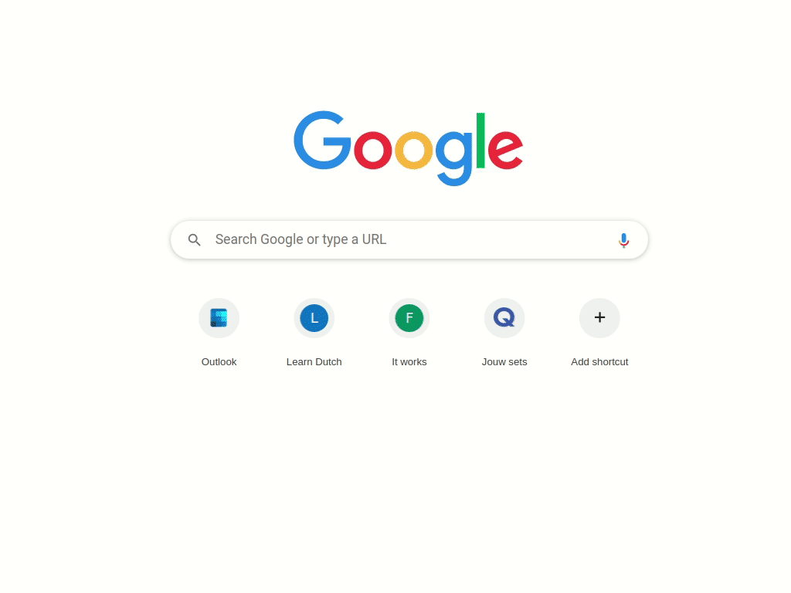

# Ulauncher 1Dictionary

 1Dictionary helps you access all your favourite dictionaries easily via Ulauncher. 


Key features:

- Fuzzy search: No worries if you made a typo!
- Multi language support: English words can be searched together with Dutch words.
- Configurable and extensible: The supported languages are certainly not limited to English and Nederstands. Check the [custom dictionaries](https://github.com/JihongJu/ulauncher-1dictionary#custom-dictionaries) section to add your favourite online dictionar~~y~~ies for your favourite languages.


## Usage




## Dependency

- [Ulauncher](https://ulauncher.io/)

## Installation


## Custom dictionaries

1. Add the vocabulary of your source language to the directory `~/.local/share/ulauncher/extensions/com.github.jihongju.ulauncher-1dictionary`. The vocabulary is a newline-delimited text file. The filename indicates the language, e.g.,

language | vocabulary file name
--- | ---
English | [english.txt](https://github.com/JihongJu/ulauncher-1dictionary/blob/master/english.txt)
Nederlands | [nederlands.txt](https://github.com/JihongJu/ulauncher-1dictionary/blob/master/english.txt)

English and Nederlands are the default vocabularies. You can find more vocabularies on [JUST WORDS!](http://www.gwicks.net/dictionaries.htm).


Notes:

- The more vocabularies, the slower the search is. Speed is often not an issue on most modern computers. But in case you feel laggy. Consider remove vocabularies you don't need. This can be done as simple as deleting the corresponding vocabulary file.


2. Add your favourtie online dictionary to the "Online dictionary" field on the  extension preference page 

Online dictionary | vocabulary needed  |  Option (language, query) 
--- | --- | --- 
[Merriam-Webster](https://www.merriam-webster.com/) | english.txt | english, https://www.merriam-webster.com/dictionary/%s
[Linguee](https://www.linguee.com/)                 | nederlands.txt | nederlands, https://www.linguee.com/dutch-english/search?source=auto&query=%s
 [Merriam-Webster](https://www.merriam-webster.com/) and [Linguee](https://www.linguee.com/) | english.txt and nederlands.txt | english, https://www.merriam-webster.com/dictionary/%s ; nederlands, https://www.linguee.com/dutch-english/search?source=auto&query=%s
Any other online dictionary | anyvocabulary.txt | anyvocabulary, query-for-any-online-dictionary-with-a-word-placeholder-'%s'

Notes:

- Use `%s` as the placeholder for the word to search in the query
- Use `,` to delimit language and query; The name of the language has to match the vocabulary file name, e.g. english -> english.txt, nederlands -> nederlands.txt
- Use `;` to delimit different dictionaries, for example, `english, https://www.merriam-webster.com/dictionary/%s ; nederlands, https://www.linguee.com/dutch-english/search?source=auto&query=%s`


## Development
1. (Exit Ulauncher if it's running) Run
```ulauncher --no-extensions --dev -v```

2. (In another terminal) Run
```
VERBOSE=1 ULAUNCHER_WS_API=ws://127.0.0.1:5054/ulauncher-1dictionary PYTHONPATH=$HOME/src/Ulauncher /usr/bin/python3 $HOME/.local/share/ulauncher/extensions/ulauncher-1dictionary/main.py
```


## References

0. [Merriam-Webster](https://www.merriam-webster.com/) 
1. [Linguee](https://www.linguee.nl/)
2. [JUST WORDS!](http://www.gwicks.net/dictionaries.htm)

