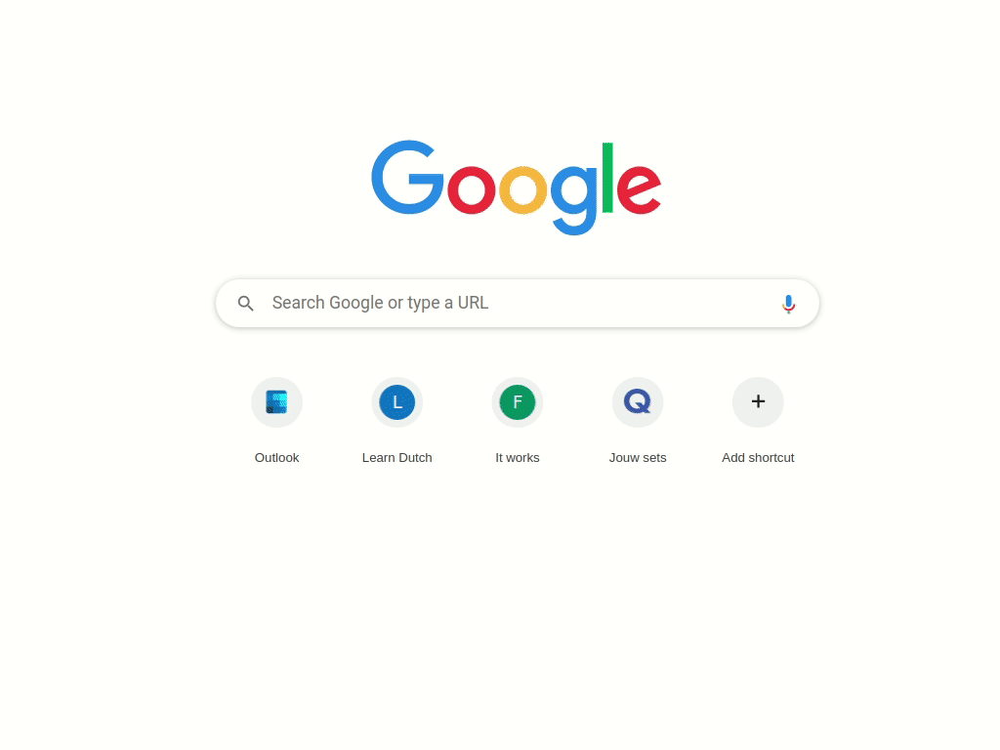

# Ulauncher 1Dictionary
 1Dictionary helps you access all your favourite dictionaries easily via Ulauncher. 


Key features:

- Fuzzy search: No worries if you made a typo!
- Multi language support: English words can be searched together with Dutch words.
- Configurable: The supported languages are certainly not limited to English and Nederlands. Supported languages include: Deutsch, English, Espanol, Francais, Italiano, Nederlands, Norsk, Swiss. For languages other than English and Nederlands. You will need to find yourself a decent online dictionary service and add it to the Online dictionary section of the extension preference. Check [custom dictionaries](https://github.com/JihongJu/ulauncher-1dictionary#custom-dictionaries) for more information.
- Extensible: It is possible to add more language support. Check the [custom dictionaries](https://github.com/JihongJu/ulauncher-1dictionary#custom-dictionaries) section to add your favourite online dictionar~~y~~ies for your favourite languages.


## Usage




## Dependency

- [Ulauncher](https://ulauncher.io/)

## Installation

Open Ulauncher Preferences, go to the "Extentions tab", click "Add Extension" and copy-paste the following link:

```
https://github.com/JihongJu/ulauncher-1dictionary
```


## Custom dictionaries


### Configure vocabulary

By default, 1Dictionary support Deutsch, English, Espanol, Francais, Italiano, Nederlands, Norsk and Swiss. Configuration is possible in the "Vocabulary" section of the extension preference.

Active your favourate vocabulory by adding it to the "Active vocabulary" field as comma-delimted text:


Notes:

- The more vocabularies activated, the slower the search is. Speed is often not an issue on most modern computers. But in case you feel laggy. Consider deactivating the vocabularies you don't need, or switch to the 'regex' matching method.


### Extend vocabulary

Deutsch, (US) English, Espanol, Francais, Italiano, Nederlands, Norsk and Swiss from [JUST WORDS!](http://www.gwicks.net/dictionaries.htm) are shipped with 1dictionary. You can extend the list by adding a new vacabulary file.

The vocabulary files locate in the directory `~/.local/share/ulauncher/extensions/com.github.jihongju.ulauncher-1dictionary`. Each vocabulary file is a newline-delimited text file. The filename indicates the language, e.g.,

language | vocabulary file name
--- | ---
English | [english.txt](https://github.com/JihongJu/ulauncher-1dictionary/blob/master/english.txt)
Nederlands | [nederlands.txt](https://github.com/JihongJu/ulauncher-1dictionary/blob/master/english.txt)


### Configure online dictionary service

Apart from English and Nederlands, 1Dictionary uses [Google Translate]() for other languages. You can add your preferred online dictionary service to gain better experience. 

Online dictionary service can be configured in the "Online dictionary" field on the  extension preference page:


Online dictionary | vocabulary needed  |  Option (language, query) 
--- | --- | --- 
[Merriam-Webster](https://www.merriam-webster.com/) | english.txt | english, https://www.merriam-webster.com/dictionary/%s
[Linguee](https://www.linguee.com/)                 | nederlands.txt | nederlands, https://www.linguee.com/dutch-english/search?source=auto&query=%s
 [Merriam-Webster](https://www.merriam-webster.com/) and [Linguee](https://www.linguee.com/) | english.txt and nederlands.txt | english, https://www.merriam-webster.com/dictionary/%s ; nederlands, https://www.linguee.com/dutch-english/search?source=auto&query=%s
Any other online dictionary | anyvocabulary.txt | anyvocabulary, query-for-any-online-dictionary-with-a-word-placeholder-'%s'

Notes:

- Use `%s` as the placeholder for the word to search in the query
- Use `,` to delimit language and query; The name of the language has to match the vocabulary file name, e.g. english -> english.txt, nederlands -> nederlands.txt
- Use `;` to delimit different dictionaries, for example, `english, https://www.merriam-webster.com/dictionary/%s ; nederlands, https://www.linguee.com/dutch-english/search?source=auto&query=%s`


## Development
1. (Exit Ulauncher if it's running) Run
```ulauncher --no-extensions --dev -v```

2. (In another terminal) Run
```
VERBOSE=1 ULAUNCHER_WS_API=ws://127.0.0.1:5054/ulauncher-1dictionary PYTHONPATH=$HOME/src/Ulauncher /usr/bin/python3 $HOME/.local/share/ulauncher/extensions/ulauncher-1dictionary/main.py
```


## References

0. [Merriam-Webster](https://www.merriam-webster.com/) 
1. [Linguee](https://www.linguee.nl/)
2. [JUST WORDS!](http://www.gwicks.net/dictionaries.htm)

