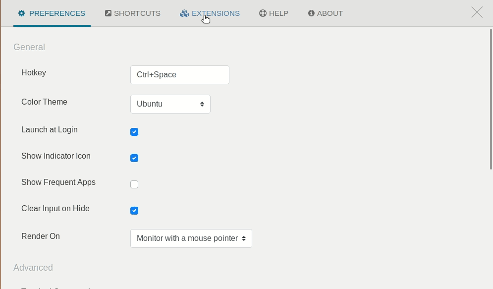

# Ulauncher 1Dictionary
 1Dictionary helps you access all your favourite dictionaries easily via Ulauncher. 


## Key features

- **Fuzzy search** No worries for typo anymore!
- **Multi language support** Many languages can be searched altogether. For example, English words can be searched together with Dutch words, as well as French, Spanish, Italian, German, Norwegian, and any other language.
- **Configurable** English and Nederlands are the default active languages. Check [custom dictionaries](https://github.com/JihongJu/ulauncher-1dictionary#custom-dictionaries) for more information about how to activate other languages.
- **Extensible** If you are learning languages other than the default supported languages. It is possible to add more language support. Check the [custom dictionaries](https://github.com/JihongJu/ulauncher-1dictionary#custom-dictionaries) section to add custom vocabular~~y~~ies and the corresponding online dictionar~~y~~ies.


## Usage


## Requirements

- [Ulauncher 5.0+](https://ulauncher.io/)

## Installation

Open Ulauncher Preferences, go to the "Extentions tab", click "Add Extension", copy-paste the following link and click the "Add" button:

```
https://github.com/JihongJu/ulauncher-1dictionary
```





## Custom dictionaries


### Configure vocabulary

By default, 1Dictionary support Deutsch, English, Espanol, Francais, Italiano, Nederlands, and Norsk. But only English and Nederlands are activated by default. You can modify the list of active vocabularies via the "Vocabulary" section of the extension preference.

Active your favourate vocabulory by adding it to the "Active vocabulary" field as comma-delimted text on the `Ulauncher->Preferences->Extensions->1Dictionary` page:


Notes:

- The more vocabularies activated, the slower the search is. Speed is often not an issue on modern computers. But in case you feel laggy. Consider deactivating the vocabularies you don't need, or switch to the 'regex' matching method.


### Configure dictionaries

1Dictionary uses the following online dictionary services by default for the supported vocabularies:

Online dictionary service | Vocabulary  |  Dictionary URL 
--- | --- | --- 
[Linguee](https://www.linguee.com/)                     | deutsch       | https://www.linguee.com/german-english/search?source=auto&query=%s
[Merriam-Webster](https://www.merriam-webster.com/)     | english       | https://www.merriam-webster.com/dictionary/%s
[SpanishDict](https://www.spanishdict.com)              | espanol       | https://www.spanishdict.com/translate/%s?langFrom=es
[Linguee](https://www.linguee.com/)                     | francais      | https://www.linguee.com/french-english/search?source=auto&query=%s
[Collins](https://www.collinsdictionary.com/)           | italiano      | https://www.collinsdictionary.com/dictionary/italian-english/%s
[Linguee](https://www.linguee.com/)                     | nederlands    | https://www.linguee.com/dutch-english/search?source=auto&query=%s
[Google Translate](https://translate.google.com/)       | norsk         | https://translate.google.com/#view=home&op=translate&sl=no&tl=en&text=%s

It is possible to modify the dictionary URL via `Ulauncher->Preferences->Extensions->1Dictionary` in the corresponding configuration field.


### Extend vocabulary

Deutsch, (US) English, Espanol, Francais, Italiano, Nederlands, and Norsk from [JUST WORDS!](http://www.gwicks.net/dictionaries.htm) are shipped with 1dictionary. You can extend the list by adding a new vacabulary file.

The vocabulary files locate in the directory `~/.local/share/ulauncher/extensions/com.github.jihongju.ulauncher-1dictionary/vocabularies`. Each vocabulary file is a newline-delimited text file. The filename indicates the language, e.g.,

language | vocabulary file name
--- | ---
English | [english.txt](https://github.com/JihongJu/ulauncher-1dictionary/blob/master/vocabularies/english.txt)
Nederlands | [nederlands.txt](https://github.com/JihongJu/ulauncher-1dictionary/blob/master/vocabularies/nederlands.txt)
Espanol | [espanol.txt](https://github.com/JihongJu/ulauncher-1dictionary/blob/master/vocabularies/espanol.txt)
Deutsch | [deutsch.txt](https://github.com/JihongJu/ulauncher-1dictionary/blob/master/vocabularies/deutsch.txt)
Francais | [francais.txt](https://github.com/JihongJu/ulauncher-1dictionary/blob/master/vocabularies/francais.txt)
Italiano | [italiano.txt](https://github.com/JihongJu/ulauncher-1dictionary/blob/master/vocabularies/italiano.txt)
Norsk | [norsk.txt](https://github.com/JihongJu/ulauncher-1dictionary/blob/master/vocabularies/norsk.txt)


### Configure online dictionary services

1Dictionary uses [Google Translate](https://translate.google.com/) for custom vocabularies. You can add your preferred online dictionary service to gain better experience. 

Online dictionary service can be configured in the "Online dictionary service" field on the extension preference page:


Online dictionary service | Vocabulary needed  |  Configuraion 
--- | --- | --- 
Any other online dictionary | anyvocabulary.txt | anyvocabulary, query-for-any-online-dictionary-with-a-word-placeholder-'%s'

Notes:

- Use `%s` as the placeholder for the word to search in the query
- Use `,` to delimit language and query; The name of the language has to match the vocabulary file name, e.g. english -> english.txt, nederlands -> nederlands.txt
- Use `;` to delimit different dictionaries, for example, `english, https://www.merriam-webster.com/dictionary/%s ; nederlands, https://www.linguee.com/dutch-english/search?source=auto&query=%s`


## Development
1. (Exit Ulauncher if it's running) Run
```ulauncher --no-extensions --dev -v```

2. (In another terminal) Run
```
VERBOSE=1 ULAUNCHER_WS_API=ws://127.0.0.1:5054/ulauncher-1dictionary PYTHONPATH=$HOME/src/Ulauncher /usr/bin/python3 $HOME/.local/share/ulauncher/extensions/ulauncher-1dictionary/main.py
```


## References

- [JUST WORDS!](http://www.gwicks.net/dictionaries.htm)
- [Linguee](https://www.linguee.com/)                     
- [Merriam-Webster](https://www.merriam-webster.com/)     
- [SpanishDict](https://www.spanishdict.com)              
- [Collins](https://www.collinsdictionary.com/)           
- [Google Translate](https://translate.google.com/)       
